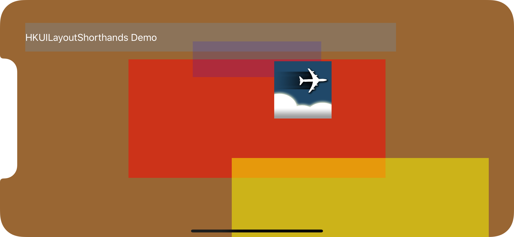

# HKUILayoutShorthands
#### Shorthand methods for Swift programmatic UI layout constraints

   

## INTRODUCTION

If you have ever programmatically set up UI elements and layout constraints in Swift, you most likely wrote something like this:

```
  let myView = UIScrollView(frame: CGRect(x: 0, y: 0, width: 100, height: 100))
  view.addSubview(myView)
  myView.translatesAutoresizingMaskIntoConstraints = false
  myView.topAnchor.constraint(equalTo: view.safeAreaLayoutGuide.topAnchor).isActive = true
  myView.bottomAnchor.constraint(equalTo: view.safeAreaLayoutGuide.bottomAnchor).isActive = true
  myView.leadingAnchor.constraint(equalTo: view.safeAreaLayoutGuide.leadingAnchor).isActive = true
  myView.trailingAnchor.constraint(equalTo: view.safeAreaLayoutGuide.trailingAnchor).isActive = true
```

There is a lot of code just for just one element. If you have a bunch of them to lay out, your code becomes very long and not exactly easy to understand at a glance.

This is why I created these shorthand methods. The above code can simply be written as:

```
  let myView = UIScrollView(frame: CGRect(x: 0, y: 0, width: 100, height: 100))
  myView.anchorAllFourSidesToSafeAreaOf(view)
```

Isn't that much better?

## ANOTHER EXAMPLE

Similarly, if you just want to align horizontally and vertically center an element, you would write:

```
  let tableView = UITableView(frame: CGRect(x: 0, y: 0, width: 100, height: 100))

  myView.addSubview(tableView)
  tableView.translatesAutoresizingMaskIntoConstraints = false
  tableView.centerXAnchor.constraint(equalTo: myView.centerXAnchor).isActive = true
  tableView.centerYAnchor.constraint(equalTo: myView.centerYAnchor).isActive = true
```

Using my shortcuts, you could just write:

```
  let tableView = UITableView(frame: CGRect(x: 0, y: 0, width: 100, height: 100))

  myView.addSubview(tableView)
  tableView.anchorAlignCenterWith(myView)
```

## MORE EXAMPLES

Here are some more examples of what you can do in other scenarios:

```
  redView.anchorAlignHorizontalCentersWith(myView)

  greenView.anchorAlignRightsWith(redView)

  blueView.anchorSetWidthToWidthOf(someOtherView, multiplier: 0.5)

  let someViewHeightConstraint =
    someView.anchorSetHeightToWidthOf(anotherView)

  yellowView.setHeightToConstant(200.0)

  purpleView.anchorAlignLeftWithRightOf(orangeView, offset: 10.0)

  insetView.anchorAlignTopGtEqToTopOf(mapView)
```

As you can see, this reduces the amount of code and also improves readability. Most of the layout constraint scenarios are covered. See the separate user's guide.

## SETUP

### To Run the Demo Application

Simply clone the demo application from https://github.com/harrisonkong/HKUILayoutShorthandsDemo and build and run.

### To Use It In Your Own project

You can either just include the UIView+HKUILayoutShorthands.swift file in your project or use CocoaPod. Don't forget to import the module if you are using CocoaPod:

```
  import HKUILayoutShorthands
```

## CUSTOMIZE

There are a lot of shortcuts in the file. You might want to delete the ones you don't use in order to cut down on size and build time.
